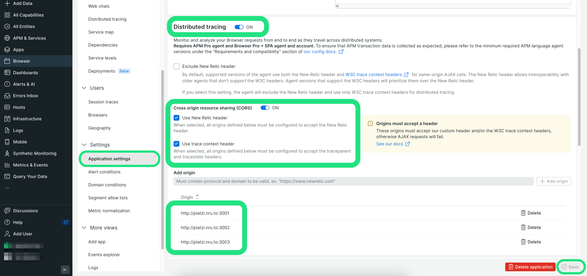

# Relicstaurants Application

> The Relicstaurants repository has been created as a microservice architecture environment so that you can test New Relic observability on a lightweight project. You can copy or fork the repository, run it locally, and implement observability yourself. 

## Requirements
In order to spin up this application locally on your device, you will need the following software:  

* A free account with [New Relic](https://newrelic.com)
* [Git](https://github.com/git-guides/install-git) - You can verify installation with `git –version`
* [Node.js & Node Package Manager (NPM)](https://docs.npmjs.com/downloading-and-installing-node-js-and-npm) - You can verify installation with `node -v` and `npm -v`
* [Xcode (Mac only)](https://developer.apple.com/xcode/) - You can verify installation with `xcode-select -p`
* [Make (Windows only)](https://linuxhint.com/run-makefile-windows/) - You can verify installation with `make -v`

*Note: the above verification commands should be ran in Terminal on Mac or Command Prompt on Windows*
## Installation
1. From a new Terminal or Command Prompt window, clone this repository using Git `git clone https://github.com/newrelic-experimental/Relicstaurants-Platzi.git`
2. Navigate into your new workspace using `cd Relicstaurants-Platzi`
3. Run `make install` if this is your first time spinning up this application
4. Run `make run`

After successfully completing the installation process above, your new application will be running at [localhost:3000](http://localhost:3000/) 

## New Relic APM Instrumentation
This application is comprised of 3 microservices: [restaurantService](restaurantService/newrelic.js), [menuService](menuService/newrelic.js), [checkoutService](checkoutService/newrelic.js). In order to monitor and observe data properly, you'll need to instrument each of these services with a separate Node.js APM agent. When you finish the steps below, you'll be running three instances of the Node.js agent. Let's start with restaurantService:

1. In your New Relic account, select **Add Data** and search for Node.js.
2. In the results under **Application monitoring**, click **Node.js**.
3. On the **Choose your instrumentation method** screen, click **On a host (without PM2)**. 
4. When asked to **Name your application**, enter a unique name such as`my-restaurant-service` and click **Save**.
5. For **Install the New Relic agent** , navigate to your Terminal or Command Prompt window, navigate to `Relicstaurants-Platzi/restaurantService` using the command `cd restaurantService` and run the command `npm install newrelic --save`
6. For **Download your custom configuration file**, click **Copy to clipboard** and then paste the contents into the file (`newrelic.js`) found in `Relicstaurants-Platzi/restaurantService`.
7. Using your IDE, Add `var newrelic = require('newrelic');` to the first line of the `Relicstaurants-Platzi/restaurantService/index.js` file.
8. Repeat the steps above for menuService and checkoutService.
9. After you've configured all three services, start your application in Terminal or Command Prompt by navigating back to the root directory of the project and running `make run`

Navigate to [localhost:3000](localhost:3000) in your browser. Make several orders in the Relicstaurants app and check the pre-built dashboards for data being observed by New Relic.

## New Relic Browser Instrumentation
The next New Relic agent to be added to this application is Browser. This will allow for you to have full stack observability and make use of the distributed tracing features of New Relic.

1. In your New Relic account, click the **add data** button, then from the **Browser & mobile** category, select **Browser monitoring** 
2. Select **Copy/Paste JavaScript Code**
3. Name your app as a standalone app called "r-frontend"
4. Click **enable**. You may ignore the HTML snippet that appears on screen for now and instead close the window. 
5. Navigate to the Browser Applications being observed in your New Relic account. You should see the service "r-frontend" listed there. Click on it.
6. Select "Application settings" view in the "Settings" section on the left *- see screenshot below*
7. Enable "Cross Origin Resource Sharing(CORS)", "Use newrelic header", "Use trace context headers" and add the backend origins ( http://platzi.nru.to:3001 http://platzi.nru.to:3002 http://platzi.nru.to:3003 ) to enable newrelic headers to be passed between the frontend app and the microservices instrumented with APM *- see screenshot below*
8. Click "Save" *- see screenshot below*
9. Copy the HTML snippet available at the top of the Application settings menu. You will then need to paste the snippet after the meta tag in the public > [index.html](public/index.html) file. 
 

After completing the steps above, generate some traffic on your application and view the data in New Relic.

## Simulate application traffic
This repository includes a simulator file that will make random orders on Relicstaurants so that you do not need to manually generate traffic. Run the simulator  script with the following steps:

1. Open a new Terminal or Command Prompt window and navigate to the **simulator** directory
2. Install [Python3](https://www.python.org/downloads/) via the Terminal or Command Prompt
3. Install all necessary software via the Terminal or Command Prompt with `pip3 install -r requirements.txt`
4. Navigate into the **simulator** directory
5. run `python3 simulator.py`

*Note: If you encounter any issues while on a Windows PC, try running this script in a administrator shell.* 

## Contributing

We encourage your contributions to improve Relicstaurants! Keep in mind when you submit your pull request, you'll need to sign the CLA via the click-through using CLA-Assistant. You only have to sign the CLA one time per project.
If you have any questions, or to execute our corporate CLA, required if your contribution is on behalf of a company, please drop us an email at opensource@newrelic.com.

### **A note about vulnerabilities**

As noted in our [security policy](../../security/policy), New Relic is committed to the privacy and security of our customers and their data. We believe that providing coordinated disclosure by security researchers and engaging with the security community are important means to achieve our security goals.

If you believe you have found a security vulnerability in this project or any of New Relic's products or websites, we welcome and greatly appreciate you reporting it to New Relic through [HackerOne](https://hackerone.com/newrelic).

## License

The Relicstaurants app has been adapted from the Open source project [FoodMe](https://github.com/IgorMinar/foodme) 

Relicstaurants is licensed under the [Apache 2.0](http://apache.org/licenses/LICENSE-2.0.txt) License.

> Relicstaurants also uses source code from third-party libraries. You can find full details on which libraries are used and the terms under which they are licensed in the third-party notices document.
